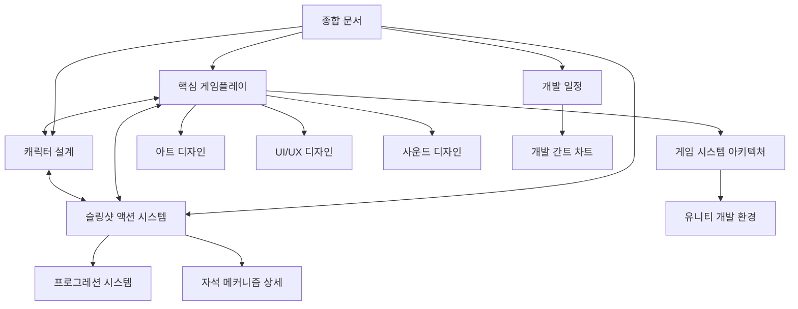

# 시그나 리바운드 - 종합 문서 및 인덱스

이 문서는 시그나 리바운드 게임 프로젝트의 개발 종합 문서, 문서 구조 및 역할 정의를 모두 통합한 종합 인덱스 문서입니다.

---

## 1. 게임 개요

### 1.1 게임 정보
- **제목**: 시그나 리바운드 (Signa Rebound)
- **장르**: 슬링샷 액션 로그라이크 (뱀서라이크 요소 통합)
- **대상 플랫폼**: Windows, Android, iOS
- **개발 기간**: 3개월 (단기 개발)
- **개발 엔진**: Unity 6000.4.24f1
- **프로젝트 관리**: Git, Trello
- **목표 출시일**: 2025년 12월 (개발 시작 기준 3개월 후)

### 1.2 핵심 컨셉
시그나노타 IP의 캐릭터들이 등장하는 슬링샷 액션 기반 로그라이트 게임으로, 플레이어는 캐릭터를 발사하여 벽과 장애물에 튕겨 적을 물리치고 던전을 탐험합니다. 반복적인 플레이를 통해 캐릭터와 능력을 강화하고 새로운 콘텐츠를 잠금 해제할 수 있습니다.

### 1.3 대상 유저
- 시그나노타 IP 팬층
- 로그라이크 장르 애호가
- 캐주얼 액션 게임 유저
- 10~30대 남녀

### 1.4 개발 목표
- 짧은 개발 기간 내 완성도 있는 게임 출시
- 원작 팬층의 호응을 얻을 수 있는 충실한 IP 재해석
- 중독성 있는 로그라이크 게임플레이 경험 제공
- 모바일과 PC 플랫폼에서의 최적화된 경험

### 1.5 스토리 및 세계관
세계관 관련 문서 전달 받은 후 작성 및 설정 예정

---

## 2. 게임 특징

### 2.1 핵심 게임플레이 메커니즘
- **슬링샷 액션**: 화면 터치/드래그로 캐릭터 발사 방향과 힘 조절
- **자석 메커니즘**: 모든 캐릭터는 기본적으로 짧은 범위의 자석 효과 보유
- **로그라이크 요소**: 영구적 죽음, 랜덤 맵, 진행에 따른 영구 업그레이드
- **뱀서라이크 요소**: 시간 경과에 따른 난이도 증가, 레벨업 시 능력/아이템 선택

자세한 내용은 [핵심_게임플레이_메커니즘](게임플레이/핵심_게임플레이_메커니즘.md) 문서를 참조하세요.

### 2.2 캐릭터 및 장비 시스템
- **캐릭터별 전용 장비**: 모든 캐릭터는 고유 특성에 맞는 전용 장비로 시작
- **장비 슬롯 시스템**: 장비 6칸, 장신구 6칸
- **아이템 수집 및 조합**: 회차 진행 중 다양한 장비와 아이템 수집 및 강화
- **시너지 시스템**: 캐릭터 특성과 장비 간의 상호작용 극대화

자세한 내용은 [캐릭터_설계](시스템_설계/캐릭터_설계.md) 문서를 참조하세요.

### 2.3 시그나노타 IP 활용
- 시그나노타의 캐릭터와 세계관 차용
- 각 캐릭터의 고유 능력을 뱀서 라이크 장르에 맞게 재해석
- 원작 BGM 리믹스 및 시각적 아이덴티티 유지

---

## 3. 기술 명세

### 3.1 개발 환경
- **엔진**: Unity 6000.4.24f1
- **렌더 파이프라인**: URP(Universal Render Pipeline)
- **그래픽스 API**:
  - Windows: DirectX11/12
  - iOS: Metal
  - Android: OpenGL ES 3.0 / Vulkan
- **해상도**: 다양한 화면 비율 지원 (16:9 기본, 모바일 가변 비율)

### 3.2 핵심 기술 구현
- **슬링샷 물리 시스템**:
  - Box2D 기반 물리 엔진 활용
  - 캐릭터별 다른 물리 속성 (질량, 탄성, 마찰)
  - 충돌 및 반동 시스템 최적화
  - 궤적 예측 및 시각화

- **자석 시스템**:
  - 기본 자석 효과 구현 (모든 캐릭터)
  - 범위 및 강도의 점진적 업그레이드
  - 아이템 및 코어 자동 수집 메커니즘
  - 자석 효과의 시각적 피드백

자세한 내용은 [슬링샷_액션_시스템](시스템_설계/슬링샷_액션_시스템.md)과 [자석_메커니즘_상세](시스템_설계/자석_메커니즘_상세.md) 문서를 참조하세요.

- **뱀서라이크 통합**:
  - 시간 기반 난이도 스케일링
  - 레벨업 및 아이템 선택 시스템
  - 회차 내 진행 및 영구 진행 분리
  - 환경 및 적 다양성 자동 조절

자세한 내용은 [프로그레션_시스템](시스템_설계/프로그레션_시스템.md) 문서를 참조하세요.

### 3.3 플랫폼별 최적화 전략
- **Windows**:
  - 고해상도 지원 및 그래픽 품질 옵션
  - 키보드/마우스 컨트롤 최적화
  - 전체화면/창모드 지원

- **모바일(Android/iOS)**:
  - 터치 컨트롤 최적화
  - 배터리 및 발열 관리
  - 다양한 기기 해상도 대응
  - 오프라인 플레이 지원

자세한 기술 구현에 관한 내용은 [기술_명세](기술_명세/) 폴더 내 문서들을 참조하세요.

---

## 4. 게임 구조

### 4.1 게임 모드
- **기본 모드**: 무한으로 생성되는 맵 내 제한시간 생존
- **서바이벌 모드**: 무한히 등장하는 적을 상대로 생존 시간 경쟁
- **도전 모드**: 일일/주간 특수 규칙 적용 도전

### 4.2 전투 시스템
- **슬링샷 전투**:
  - 충돌시 데미지 적용
  - 연속 타격 및 콤보 시스템
  - 환경 활용 전략 (반사, 튕김 등)

- **적 시스템**:
  - 기본, 엘리트, 보스
  - 시간 경과에 따른 강화 메커니즘
  - 패턴 기반 AI 행동
  - 특수 능력 및 방어 매커니즘

### 4.3 프로그레션 시스템
- **회차 내 프로그레션**:
  - 레벨업 및 능력 선택
  - 아이템 및 장비 수집
  - 임시 강화 및 조합
  
- **영구 프로그레션**:
  - 코어 수집 및 사용
  - 캐릭터 및 장비 해금
  - 능력치 영구 강화
  - 시작 조건 개선

자세한 내용은 [프로그레션_시스템](시스템_설계/프로그레션_시스템.md) 문서를 참조하세요.

---

## 5. 개발 일정 및 우선순위

### 5.1 1개월 차: 기초 시스템 구축
- **1주차**: 
  - 프로젝트 셋업 및 관리 도구 구성
  - **슬링샷 메커니즘 기본 구현**
  - **자석 효과 기본 구현**

- **2-3주차**:
  - 물리 시스템 최적화
  - 기본 캐릭터 및 전용 장비 구현
  - 스테이지 및 방 생성 시스템

- **4주차**:
  - **레벨업 및 장비 시스템 프로토타입**
  - 첫 번째 스테이지 및 적 AI 구현
  - 기본 UI 요소 구현

### 5.2 2개월 차: 콘텐츠 확장
- **5-6주차**:
  - 추가 캐릭터 및 전용 장비 구현
  - **장비 슬롯 및 아이템 조합 시스템**
  - 보스 전투 시스템

- **7-8주차**:
  - 추가 스테이지 환경 및 적 유형
  - **시간 기반 난이도 스케일링**
  - 영구 프로그레션 시스템 구현

### 5.3 3개월 차: 폴리싱 및 최적화
- **9-10주차**:
  - 플랫폼별 컨트롤 최적화
  - 성능 및 메모리 최적화
  - 사운드 및 시각 효과 구현

- **11-12주차**:
  - 밸런싱 및 난이도 조정
  - 버그 수정 및 폴리싱
  - 출시 준비 및 테스트

자세한 일정은 **개발_일정** 폴더 내 문서들을 참조하세요.

---

## 6. 문서 구조 및 역할 정의

### 6.1 폴더 구조

시그나 리바운드 프로젝트는 다음과 같은 폴더 구조로 구성되어 있습니다:

- **프로젝트_개요/** - 프로젝트의 기본 정보와 개요 문서
- **게임플레이/** - 게임플레이 관련 문서
- **시스템_설계/** - 게임 시스템 설계 문서
- **콘텐츠/** - 게임 콘텐츠 설계 문서(맵)
- **기술_명세/** - 기술적 명세와 구현 관련 문서
- **아트_디자인/** - 아트 디자인 관련 문서
- **UI_UX/** - 사용자 인터페이스 및 경험 관련 문서
- **사운드_음악/** - 사운드 및 음악 관련 문서
- **개발_일정/** - 개발 일정 및 계획 문서
- **참고자료/** - 참고 자료 모음
- **Templates/** - 문서 템플릿 모음

### 6.2 핵심 문서 및 역할

#### 6.2.1 게임플레이 문서

- [게임플레이/핵심_게임플레이_메커니즘.md](게임플레이/핵심_게임플레이_메커니즘.md)
  - **역할**: 게임 내 시스템에 대한 간략한 설명
  - **내용**: 
    - 슬링샷 액션 시스템
    - 자석 메커니즘
    - 로그라이크 진행 시스템
    - 전투 및 적 시스템
    - 캐릭터 및 장비

#### 6.2.2 시스템 설계 문서

- [시스템_설계/캐릭터_설계.md](시스템_설계/캐릭터_설계.md)
  - **역할**: 캐릭터 및 장비 시스템 전용 문서
  - **내용**: 
    - 스텟 종류 및 적용
    - 해금 조건
    - 전용 장비

- [시스템_설계/슬링샷_액션_시스템.md](시스템_설계/슬링샷_액션_시스템.md)
  - **역할**: 기본이 되는 전투 메커니즘 설명
  - **내용**: 
    - 기본 슬링샷 메커니즘
    - 고급 슬링샷 메커니즘

- [시스템_설계/프로그레션_시스템.md](시스템_설계/프로그레션_시스템.md)
  - **역할**: 장기적 진행 및 메타 게임 시스템
  - **내용**: 
    - 인게임 프로그레션
    - 메타 프로그레션 (영구 진행)
    - 게임 모드

- [시스템_설계/자석_메커니즘_상세.md](시스템_설계/자석_메커니즘_상세.md)
  - **역할**: 자석 효과의 상세 구현
  - **내용**:
    - 자석 효과 물리 구현
    - 범위 및 강도 설정
    - 상호작용 규칙

#### 6.2.3 기술 명세 문서

- [기술_명세/게임_시스템_아키텍처.md](기술_명세/게임_시스템_아키텍처.md)
  - **역할**: 게임 시스템 기술 구현 설명
  - **내용**:
    - 물리 시스템
    - 던전 생성
    - 데미지 계산 등

- [기술_명세/유니티_개발_환경_설정.md](기술_명세/유니티_개발_환경_설정.md)
  - **역할**: 개발 환경 설정 가이드
  - **내용**:
    - 유니티 엔진 설정
    - 플랫폼 최적화 등

#### 6.2.4 아트 및 UI/UX 문서

- [아트_디자인/아트_디자인_가이드.md](아트_디자인/아트_디자인_가이드.md)
  - **역할**: 게임의 시각적 스타일 가이드
  - **내용**:
    - 시각적 스타일
    - 캐릭터 디자인
    - 환경 디자인 등

- [UI_UX/UI_UX_디자인_가이드.md](UI_UX/UI_UX_디자인_가이드.md)
  - **역할**: 사용자 인터페이스 설계
  - **내용**:
    - UI 스타일
    - HUD
    - 메뉴 시스템
    - 피드백 디자인 등

#### 6.2.5 사운드 및 음악 문서

- [사운드_음악/사운드_및_음악_디자인.md](사운드_음악/사운드_및_음악_디자인.md)
  - **역할**: 게임 오디오 설계
  - **내용**:
    - 사운드 디자인
    - 음악
    - 효과음
    - 적응형 오디오 등

#### 6.2.6 개발 일정 문서

- [개발_일정/개발_일정_및_마일스톤.md](개발_일정/개발_일정_및_마일스톤.md)
  - **역할**: 프로젝트 일정 및 계획
  - **내용**:
    - 개발 계획
    - 일정
    - 마일스톤

- [개발_일정/개발_간트_차트.md](개발_일정/개발_간트_차트.md)
  - **역할**: 시각적 개발 일정 표시
  - **내용**:
    - 시각적 개발 일정 차트

#### 6.2.7 참고 자료

- [참고자료/참고_게임_및_벤치마킹.md](참고자료/참고_게임_및_벤치마킹.md)
  - **역할**: 참고 자료 모음
  - **내용**:
    - 참고 게임
    - 기술 벤치마킹
    - 디자인 참고 자료 등

### 6.3 문서 간 관계 다이어그램

## 7. 문서 관리 지침

### 7.1 중복 제거 및 참조 시스템

각 문서는 고유한 내용에 집중하고, 다른 문서의 내용이 필요할 경우 참조 링크를 사용합니다.

#### 7.1.1 참조 표기법
- "슬링샷 액션에 대한 자세한 내용은 [슬링샷_액션_시스템](시스템_설계/슬링샷_액션_시스템.md)을 참조하세요."
- "캐릭터 특성에 관한 상세 정보는 [캐릭터 설계](시스템_설계/캐릭터_설계.md) 문서에서 확인할 수 있습니다."

#### 7.1.2 문서 구조화 원칙
1. 각 문서는 명확한 주제와 범위를 가짐
2. 상세 구현 내용은 전문 문서에 기록
3. 요약 문서는 개요만 제공하고 상세 문서 참조
4. 기획적 측면과 기술적 측면 분리
5. 문서 간 상호 참조 활용
6. 참조 링크는 `[문서명](경로/파일명.md)` 형식으로 통일

### 7.2 정리 계획 및 문서 관리 규칙

#### 7.2.1 정리 계획
다음 문서들의 내용을 정리하여 중복을 제거하고 각 문서의 역할에 맞게 재구성합니다:

1. **종합 문서**: 핵심 요약만 남기고 상세 내용은 참조로 대체
2. **핵심 게임플레이 메커니즘**: 슬링샷 물리와 게임 루프에 집중
3. **캐릭터 설계**: 캐릭터와 장비 시스템에 집중
4. **프로그레션 시스템**: 장기적 진행과 메타 게임에 집중

#### 7.2.2 문서 관리 규칙
1. 모든 새로운 문서는 이 인덱스에 등록
2. 문서 수정 시 관련 문서 참조 확인 및 업데이트
3. 폴더 구조 유지 및 문서 네이밍 규칙 준수
4. 정기적인 문서 검토 및 정리

---

*이 문서는 시그나 리바운드 프로젝트의 게임 개발 종합 문서와 문서 구조 및 인덱스를 통합한 문서입니다. 모든 문서 작업 시 이 문서를 참조하여 일관성과 명확성을 유지해주세요. 문서를 추가하거나 수정할 때 이 인덱스도 함께 업데이트해주세요.*