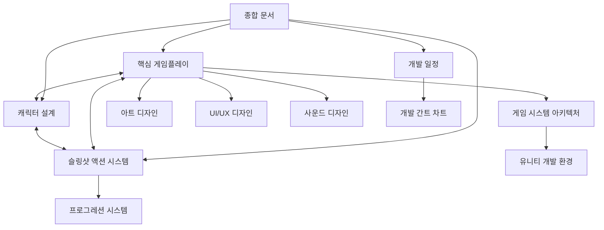

# 시그나 리바운드 기획서 인덱스

이 문서는 시그나 리바운드 게임 기획서의 구조와 내용을 안내합니다. 각 섹션은 해당 폴더와 파일로 연결되어 있습니다.

## 핵심 개요 문서
- [시그나 리바운드 - 게임 개발 종합 문서](시그나%20리바운드%20-%20게임%20개발%20종합%20문서.md) - 전체 게임 개발 계획을 간략하게 요약한 문서
- [문서 구조 및 역할 정의](문서%20구조%20및%20역할%20정의.md) - 기획서 구조 및 문서 간 관계 안내
- [00_시그나 리바운드 폴더 구조](00_시그나%20리바운드%20폴더%20구조.md) - 기획서 폴더 구조 안내

## 프로젝트 개요
- [01_프로젝트_개요](00_프로젝트_개요/01_프로젝트_개요.md) - 게임 콘셉트, 개발 목표, 타겟 플랫폼 등
- [02_스토리_설정](00_프로젝트_개요/02_스토리_설정.md) - 게임 세계관, 스토리 배경, 캐릭터 설정 등

## 게임플레이
- [01_핵심_게임플레이_메커니즘](01_게임플레이/01_핵심_게임플레이_메커니즘.md) - 슬링샷 액션, 로그라이크 요소, 전투 시스템 등
- [02_캐릭터_설계](01_게임플레이/02_캐릭터_설계.md) - 플레이어블 캐릭터, 적 캐릭터, 보스 디자인, 장비 시스템 등
- [슬링샷_액션_시스템](슬링샷_액션_시스템.md) - 자석 메커니즘 및 뱀서라이크 통합 시스템 상세 설명

## 시스템 설계
- [01_프로그레션_시스템](02_시스템_설계/01_프로그레션_시스템.md) - 레벨업, 메타 프로그레션, 능력치 시스템 등
- [02_아이템_장비_시스템](02_시스템_설계/02_아이템_장비_시스템.md) - 아이템 설계 및 장비 시스템
- [03_난이도_밸런싱](02_시스템_설계/03_난이도_밸런싱.md) - 난이도 조정 및 게임 밸런싱

## 콘텐츠
- [01_스테이지_디자인](03_콘텐츠/01_스테이지_디자인.md) - 레벨 및 스테이지 디자인
- [02_아이템_데이터베이스](03_콘텐츠/02_아이템_데이터베이스.md) - 아이템 목록 및 데이터
- [03_능력_목록](03_콘텐츠/03_능력_목록.md) - 캐릭터 능력 및 특성

## 기술 명세
- [01_게임_시스템_아키텍처](04_기술_명세/01_게임_시스템_아키텍처.md) - 물리 시스템, 던전 생성, 데미지 계산 등
- [02_유니티_개발_환경_설정](04_기술_명세/02_유니티_개발_환경_설정.md) - 유니티 엔진 설정, 플랫폼 최적화, 성능 고려사항 등

## 아트 디자인
- [01_아트_디자인_가이드](05_아트_디자인/01_아트_디자인_가이드.md) - 시각적 스타일, 캐릭터 디자인, 환경 디자인, 이펙트 등

## UI/UX 디자인
- [01_UI_UX_디자인_가이드](06_UI_UX/01_UI_UX_디자인_가이드.md) - UI 스타일, HUD, 메뉴 시스템, 피드백 디자인 등

## 사운드 및 음악
- [01_사운드_및_음악_디자인](07_사운드_음악/01_사운드_및_음악_디자인.md) - 사운드 디자인, 음악, 효과음, 적응형 오디오 등

## 마케팅 및 비즈니스
- [01_출시_전략](08_마케팅_비즈니스/01_출시_전략.md) - 마케팅 전략, 수익화 모델, 출시 계획 등

## 개발 일정
- [01_개발_일정_및_마일스톤](09_개발_일정/01_개발_일정_및_마일스톤.md) - 개발 계획, 일정, 마일스톤, 위험 관리 등
- [02_개발_간트_차트](09_개발_일정/02_개발_간트_차트.md) - 시각적 개발 일정 차트

## 참고 자료
- [01_참고_게임_및_벤치마킹](10_참고자료/01_참고_게임_및_벤치마킹.md) - 참고 게임, 기술 벤치마킹, 디자인 참고 자료 등

## 회의록
- 회의 진행에 따라 11_회의록/ 폴더에 회의록 추가 예정

## 문서 간 관계 다이어그램

## 변경 및 업데이트 지침

1. 문서 업데이트 시 중복 내용 확인
2. 내용이 다른 문서와 중복될 경우 참조 링크 사용
3. 문서 간 일관성 유지를 위해 용어 통일
4. 변경된 내용은 핵심 문서에 우선 반영 후 관련 문서 업데이트
5. 주요 변경사항은 [문서 구조 및 역할 정의](문서%20구조%20및%20역할%20정의.md) 문서에 기록