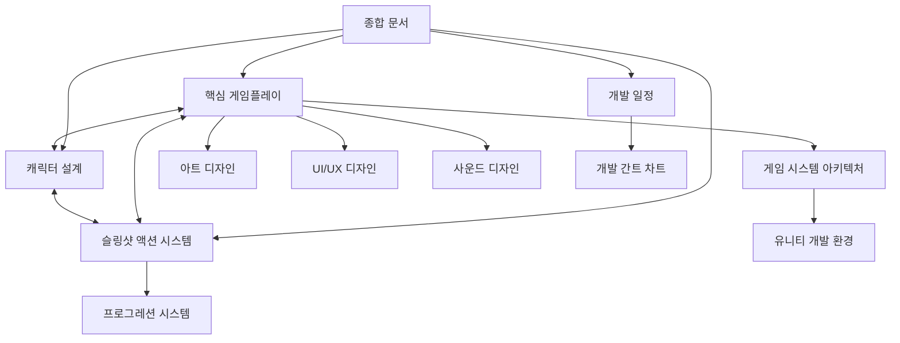

# 시그나 리바운드 기획서 인덱스

이 문서는 시그나 리바운드 게임 프로젝트의 문서 내비게이션을 위한 인덱스입니다. 각 섹션은 해당 폴더와 파일로 연결되어 있습니다.

## 핵심 문서

- [시그나 리바운드 - 게임 개발 종합 문서](시그나%20리바운드%20-%20게임%20개발%20종합%20문서.md) - 게임 개념과 핵심 특징 요약
- [문서 구조 및 역할 정의](문서%20구조%20및%20역할%20정의.md) - 기획서 구조와 문서 관리 가이드

## 프로젝트 개요
- [프로젝트_개요](프로젝트_개요.md) - 게임 컨셉트, 개발 목표, 타깃 플랫폼 등
- [스토리_설정](스토리_설정.md) - 게임 세계관, 스토리 배경, 캐릭터 설정 등

## 게임플레이
- [핵심_게임플레이_메커니즘](핵심_게임플레이_메커니즘.md) - 슬링샷 액션, 로그라이크 요소, 전투 시스템 등

## 시스템 설계
- [슬링샷_액션_시스템](슬링샷_액션_시스템.md) - 슬링샷 물리 시스템과 자석 효과 구현
- [캐릭터_설계](캐릭터_설계.md) - 플레이어블 캐릭터, 장비 시스템, 능력치 등
- [프로그레션_시스템](프로그레션_시스템.md) - 레벨업, 메타 프로그레션, 능력치 시스템 등
- [자석_메커니즘_상세](자석_메커니즘_상세.md) - 자석 효과의 상세 구현

## 기술 명세
- [게임_시스템_아키텍처](게임_시스템_아키텍처.md) - 물리 시스템, 던전 생성, 데미지 계산 등
- [유니티_개발_환경_설정](유니티_개발_환경_설정.md) - 유니티 엔진 설정, 플랫폼 최적화 등

## 아트 디자인
- [아트_디자인_가이드](아트_디자인_가이드.md) - 시각적 스타일, 캐릭터 디자인, 환경 디자인 등

## UI/UX 디자인
- [UI_UX_디자인_가이드](UI_UX_디자인_가이드.md) - UI 스타일, HUD, 메뉴 시스템, 피드백 디자인 등

## 사운드 및 음악
- [사운드_및_음악_디자인](사운드_및_음악_디자인.md) - 사운드 디자인, 음악, 효과음, 적응형 오디오 등

## 개발 일정
- [개발_일정_및_마일스톤](개발_일정_및_마일스톤.md) - 개발 계획, 일정, 마일스톤
- [개발_간트_차트](개발_간트_차트.md) - 시각적 개발 일정 차트

## 참고 자료
- [참고_게임_및_벤치마킹](참고_게임_및_벤치마킹.md) - 참고 게임, 기술 벤치마킹, 디자인 참고 자료 등

## 문서 간 관계 다이어그램

## 문서 관리 지침

1. 각 문서는 고유한 주제와 범위를 가짐
2. 상세 구현 내용은 전문 문서에 기록
3. 요약 문서는 개요만 제공하고 상세 문서 참조
4. 참조 링크는 `[문서명](경로/파일명.md)` 형식으로 통일
5. 문서 간 상호 참조 활용

*이 인덱스 문서는 프로젝트 전체 문서의 네비게이션 도구로 사용됩니다. 문서를 추가하거나 수정할 때 이 인덱스도 함께 업데이트해주세요.*