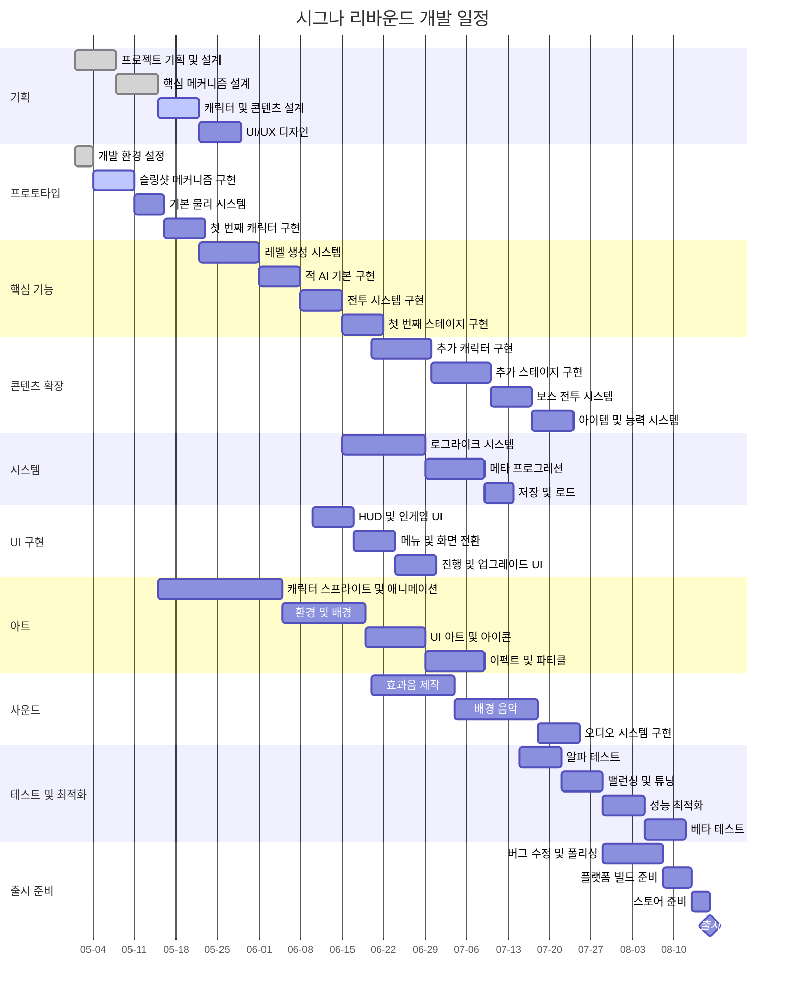

# 개발 일정 간트 차트

## 마일스톤 요약

### 1단계: 기반 구축 (5월 1일 ~ 5월 31일)
- 프로젝트 기획 및 설정 완료
- 핵심 슬링샷 메커니즘 프로토타입
- 첫 번째 플레이어블 캐릭터 구현
- 기본 물리 및 충돌 시스템 작동

### 2단계: 콘텐츠 확장 (6월 1일 ~ 6월 30일)
- 로그라이크 시스템 구현
- 추가 캐릭터 및 능력 구현
- 레벨 생성 및 적 AI 시스템
- UI 및 메뉴 시스템 구현

### 3단계: 완성 및 폴리싱 (7월 1일 ~ 7월 31일)
- 모든 스테이지 및 보스 구현
- 사운드 및 음악 완성
- 테스트 및 밸런싱
- 최적화 및 버그 수정

### 최종 출시: 8월 초
- 모든 플랫폼 출시 준비 완료
- 마케팅 자료 및 스토어 페이지 준비
- 출시 후 업데이트 계획 수립